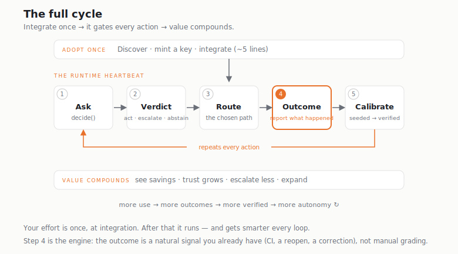

# Warm Winter examples

**Letting an agent merge its own PRs or fire its own tools is great — until the one
time it shouldn't have.** These are copyable examples of putting a calibrated check
in front of those decisions with [Warm Winter](https://warmwinter.io): before the
action, it says **act, escalate, or abstain** — and abstains when it isn't grounded
enough to be sure. You keep executing; it only judges, then learns from the outcome
you report.



```bash
pip install warmwinter      # Python
npm install warmwinter      # TypeScript / JavaScript
```

Mint a key on the [dashboard](https://warmwinter.io), then:

| Example | What it gates |
|---|---|
| [`model-routing/`](model-routing/) | Is the cheap model enough here, or escalate to the expensive one? ~95% of the quality at 57% of the cost. |
| [`auto-merge/`](auto-merge/) | Should an agent's PR auto-merge unsupervised? CI is the verifier — it auto-reports. |
| [`tool-call/`](tool-call/) | Should an agent execute this tool call, or stop and ask a human? Stakes scale with reversibility. |
| [`claude-code/`](claude-code/) | Gate your **Claude Code** agent's tool calls via a hook. Starts in shadow (observe-only, zero friction) and earns autonomy as CI/health outcomes verify each cell. |
| [`rag/`](rag/) | Is the retrieval grounded enough to answer, or abstain instead of guessing? |
| [`support/`](support/) | Auto-resolve the ticket, or route to a human? The reopen is the verifier. |

The gate **advises** — your code decides whether to act. It never sits in your
execution path. The value isn't routing; it's *calibration*: a check that knows
when it doesn't know, and abstains instead of rubber-stamping. See the
[verified track record](https://warmwinter.io) (weather, grid prices, flight
delays — including where it correctly abstains).
